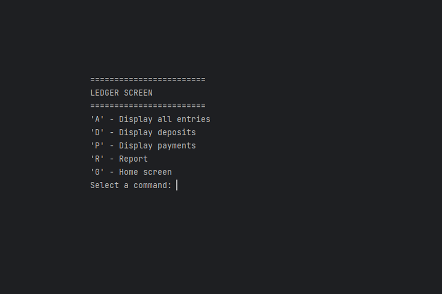

# Accounting Ledger App 🧾

The Accounting Ledger App is a simple Java program that simulates an accounting ledger. It allows the user to add deposits, make payments, view the ledger, and exit the program. Transactions are stored in a CSV file named "transactions.csv" and loaded into a `HashMap` when the program starts.
## Getting Started 🚀 

To run this application, you'll need to have Java installed on your computer. You can download the latest version of Java [here](https://www.java.com/en/download/).

Once you have Java installed, open the IntellJ IDE. Then navigate to the main.java file and press run.

## Interesting Code &nbsp; 

This code is interesting because it demonstrates the use of the ternary operator ? in Java to provide a concise way of writing conditional statements. The ternary operator allows for a shorthand way of writing if-else statements, and in this case, it is used to determine whether a deposit or payment has been made and print a success message.  Moreover, the use of different text colors for success messages can help to make the output more visually appealing and easier to read.

`// success message in blue
System.out.println(type.equals("deposit") ? ColorCodes.PURPLE + "Deposit made" + ColorCodes.RESET :
ColorCodes.PURPLE + "Payment made" + ColorCodes.RESET);`

## CLI Screenshots 📷 
Home screen

Ledger Screen

Report Screen

Making Transaction (Sample)

Entry Table (Sample)

## 📘 How to use 
### 🏠 Home Screen

Upon running the application, the user is presented with a menu screen containing four options:

  - 'D' - Add Deposit: This option allows the user to add a new deposit entry to the ledger. A deposit represents an inflow of money into the account.
  - 'P' - Make Payment (Debit): This option allows the user to make a new payment (debit) entry in the ledger. A payment represents an outflow of money from the account.
  - 'L' - Ledger: This option displays all the entries in the ledger, including deposits and payments.
  - 'X' - Exit: This option allows the user to exit the application.

To select an option, the user is prompted to enter a command by typing the corresponding letter. Once a valid command is entered, the application performs the selected action and returns to the menu screen.

### 💱 Make Transaction
Making a transaction (deposit/payment) allows the user to add a deposit/payment to the accounting ledger. The user is prompted to enter the deposit/payment amount, description, and vendor for the transaction. Once entered, the deposit is added to the ledger and the user is returned to the main menu

### 📊 Ledger Screen
The Ledger Screen displays a menu of options for managing the accounting ledger. The available commands include displaying all ledger entries, displaying only deposit or payment entries, generating a report, or returning to the home screen. Users can select the desired command by entering the corresponding letter on the keyboard.

### 📄 Report Screen
The Report Screen is where the user can generate financial reports. It presents a numbered list of options to select from to create a report based on the user's choice. The options include generating reports for different time periods like the month-to-date, previous month, year-to-date, or previous year. The user can also choose to generate a report for a specific vendor, perform a custom search, or return to the home screen.

